# Лабораторная работа №2. Введение в AWS. Вычислительные сервисы

## Цель работы
Познакомиться с основными вычислительными сервисами AWS, научиться создавать и настраивать виртуальные машины EC2 и развёртывать простые PHP-приложения.

## Постановка задачи
- зарегистрироваться в AWS и работать в регионе `eu-central-1`;
- создать IAM-группу и пользователя с правами администратора;
- настроить бюджет Zero Spend;
- запустить экземпляр Amazon EC2 и подготовить его с помощью User Data;
- проверить мониторинг и журналы системы;
- подключиться к инстансу по SSH с использованием ключей;
- развернуть собственный сайт на PHP и настроить Nginx + PHP-FPM;
- остановить инстанс через AWS CLI и подготовить отчёт.

## Артефакты репозитория
- Исходный код сайта: `lab02/public`.
- Конфигурация nginx: `lab02/nginx_mywebsite.conf`.
- Скриншоты выполнения лабораторной: `lab02/img`.
- Итоговый отчёт: `lab02/readme.md`.

## Ход выполнения

### Задание 0. Подготовка среды
- Зарегистрировался в AWS, активировал бесплатный уровень и убедился, что работаю в регионе `EU (Frankfurt) eu-central-1`.
- Выполнил первичный вход в консоль от имени root-пользователя, затем переключился на IAM-пользователя для дальнейшей работы.

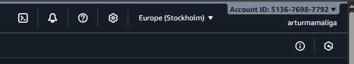

### Задание 1. Создание IAM группы и пользователя
- В сервисе IAM создал группу `Admins` и прикрепил политику `AdministratorAccess`, чтобы получить полный административный доступ.

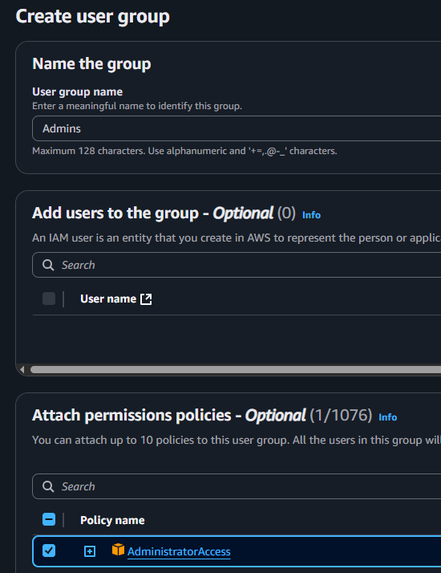

- Настроил создание нового пользователя: задал имя `cloudstudent`, разрешил вход в консоль, добавил в группу и сохранил параметры.

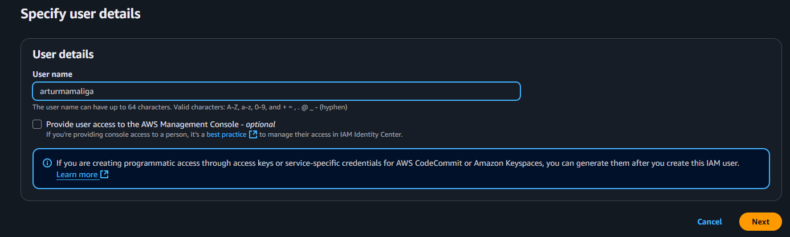
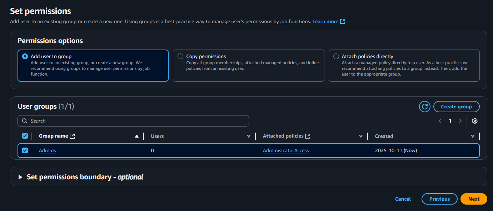
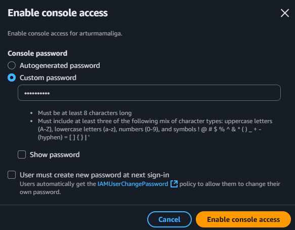

### Задание 2. Настройка Zero-Spend Budget
- В Billing and Cost Management создал бюджет типа Zero Spend с именем `ZeroSpend` и указал уведомления на свой e-mail.

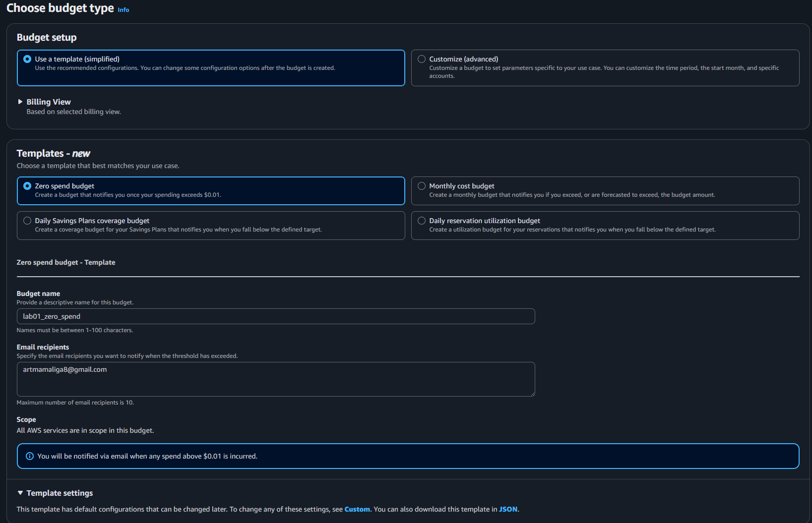

### Задание 3. Создание и запуск EC2 экземпляра
- На шаге Launch instance настроил имя `webserver`, выбрал Amazon Linux 2023 AMI и тип `t3.micro`.

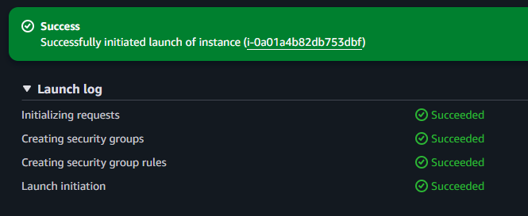

- Сгенерировал новую пару ключей `arthur-keypair.pem` и скачал приватный ключ для дальнейшего SSH-доступа.

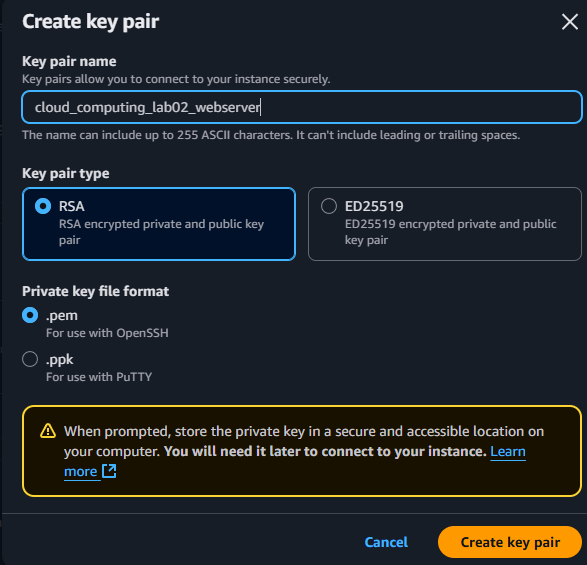

- Настроил Security Group `webserver-sg`: открыл HTTP с любого IP и ограничил SSH своим адресом.

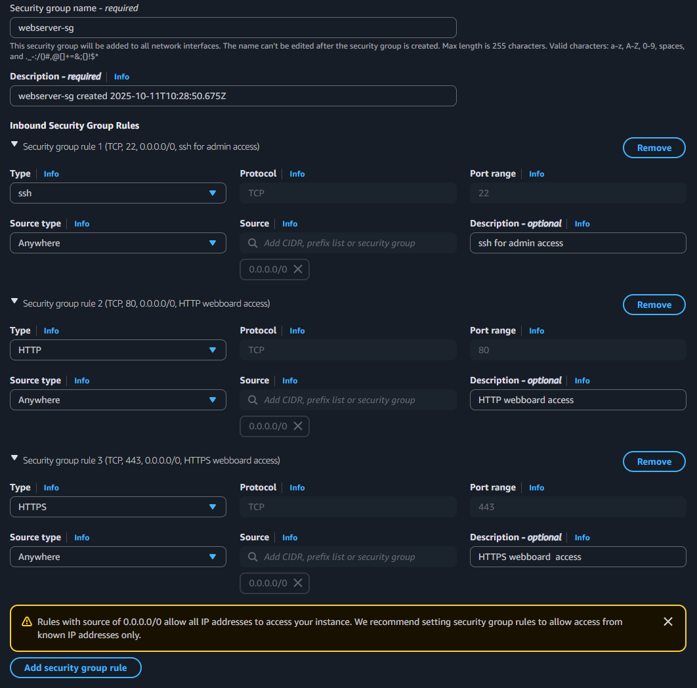

- В секции User Data разместил скрипт автоматической установки и запуска Nginx.

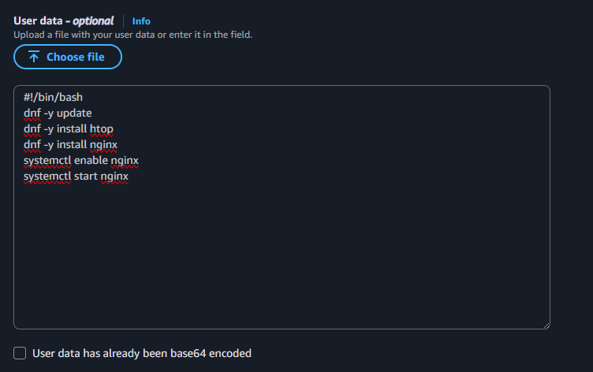

- Запустил инстанс и дождался статуса `running`, после чего убедился, что публичный IP активен.

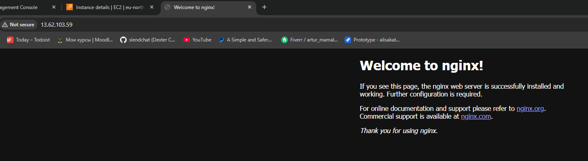
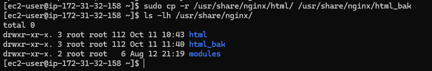

### Задание 4. Логирование и мониторинг
- На вкладке Status checks проверил, что обе проверки прошли успешно (2/2).

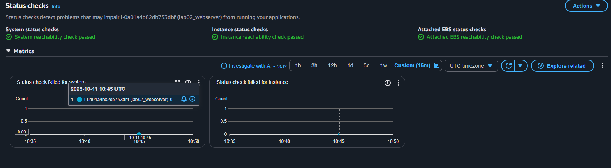

- Изучил базовые метрики CloudWatch и увеличил график CPU для детального просмотра.

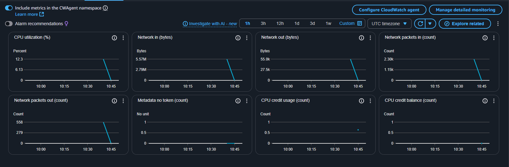
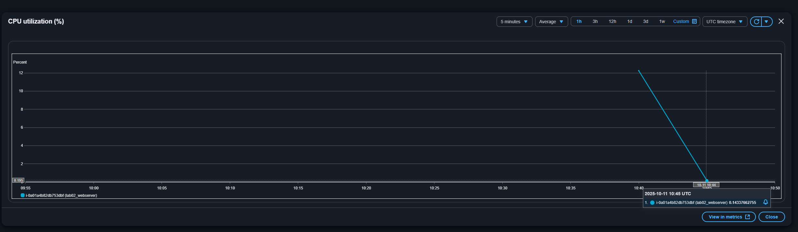

- Получил системный лог и нашёл в нём вывод cloud-init о выполнении скрипта User Data.

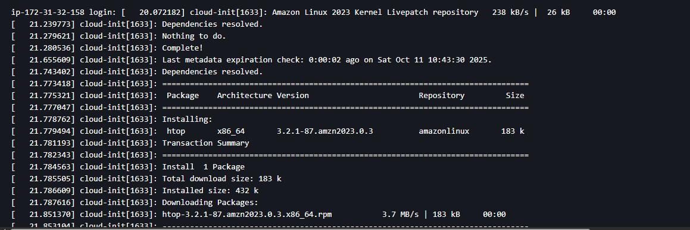
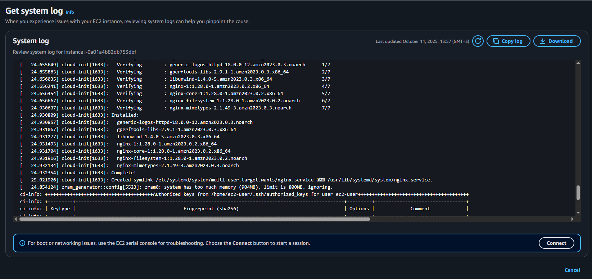

- Сделал снимок экрана консоли инстанса через функцию Instance Screenshot.

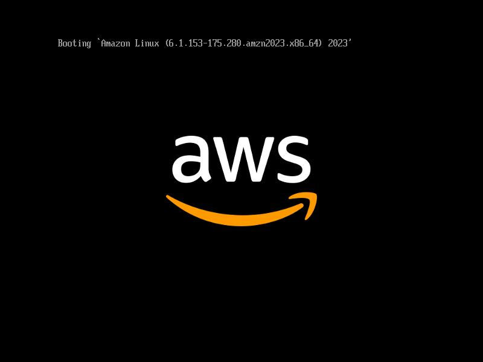

### Задание 5. Подключение к EC2 инстансу по SSH
- Настроил права доступа к приватному ключу `.pem` согласно рекомендациям AWS.

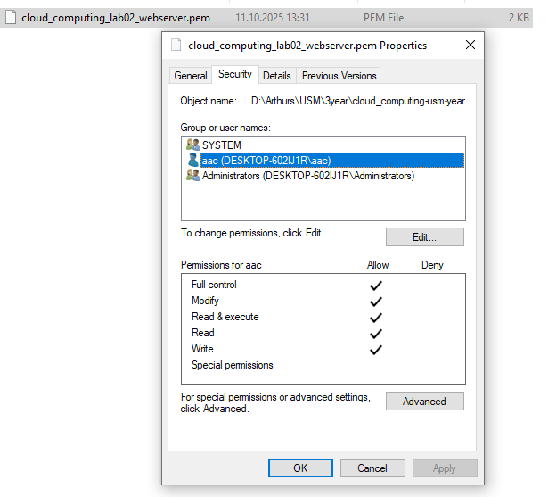

- Подключился к инстансу по SSH с помощью команды `ssh -i arthur-keypair.pem ec2-user@<Public-IP>`.

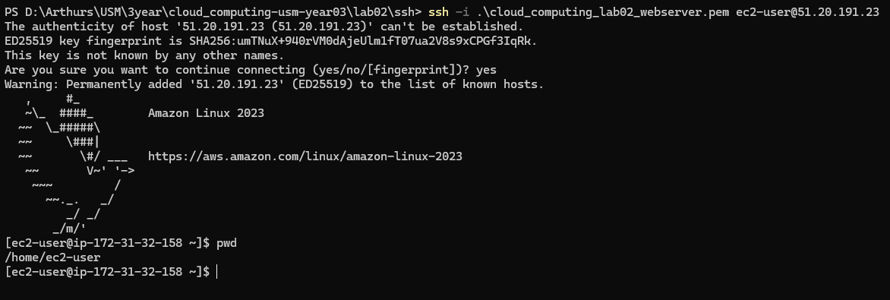

- Проверил выполнение сервиса Nginx.

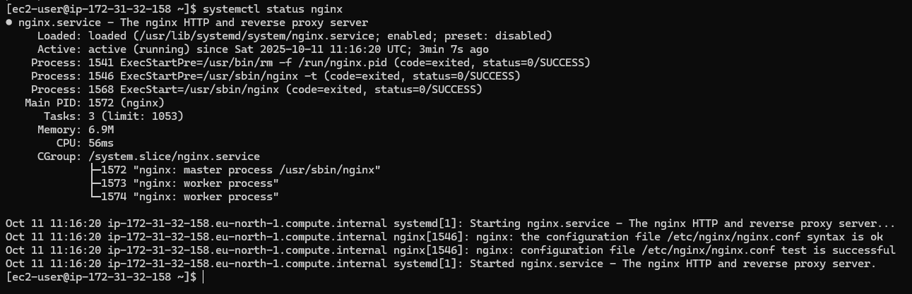

### Задание 6b. Развёртывание веб-сайта на PHP
- Подготовил локально простое PHP-приложение из трёх страниц: `index.php` (галерея), `facts.php` (факты), `care.php` (советы). Код лежит в `lab02/public`.
- Скопировал файлы сайта на сервер через `scp` и зафиксировал процесс.

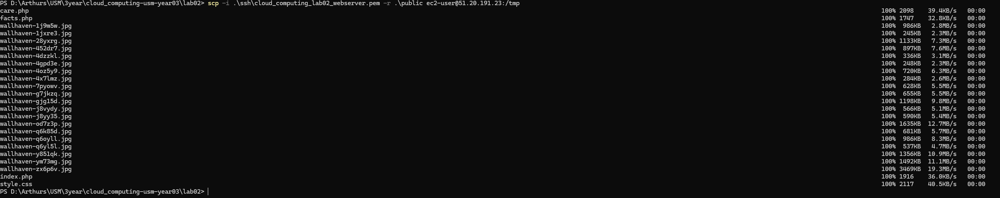
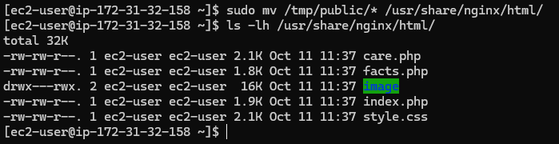

- Создал конфигурацию `nginx_mywebsite.conf` и загрузил её на сервер. На первом запуске появилась ошибка в синтаксисе, которую исправил.

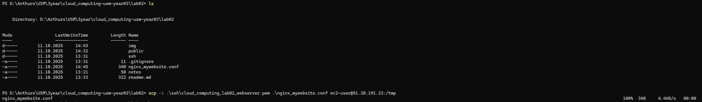
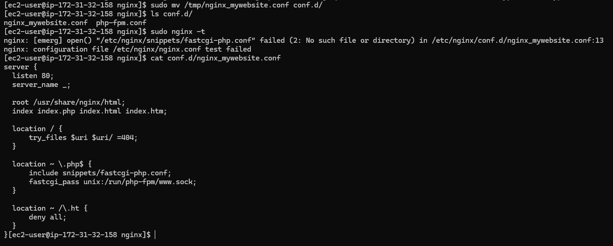
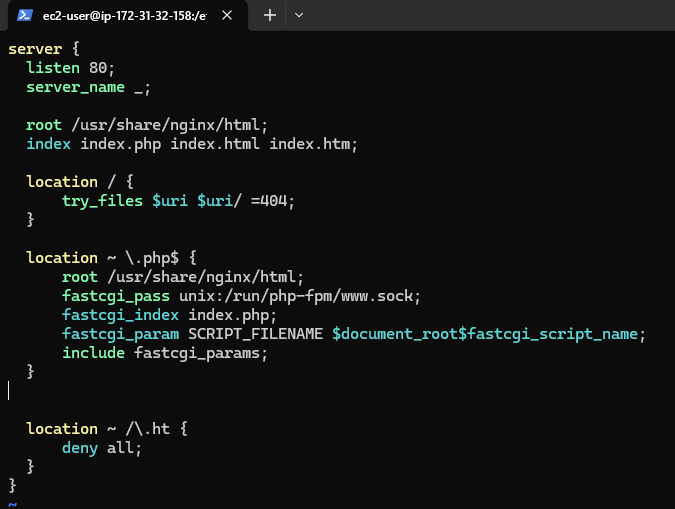
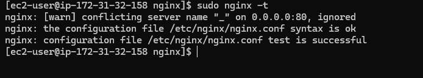

- Убедился, что службы Nginx и PHP-FPM работают корректно.

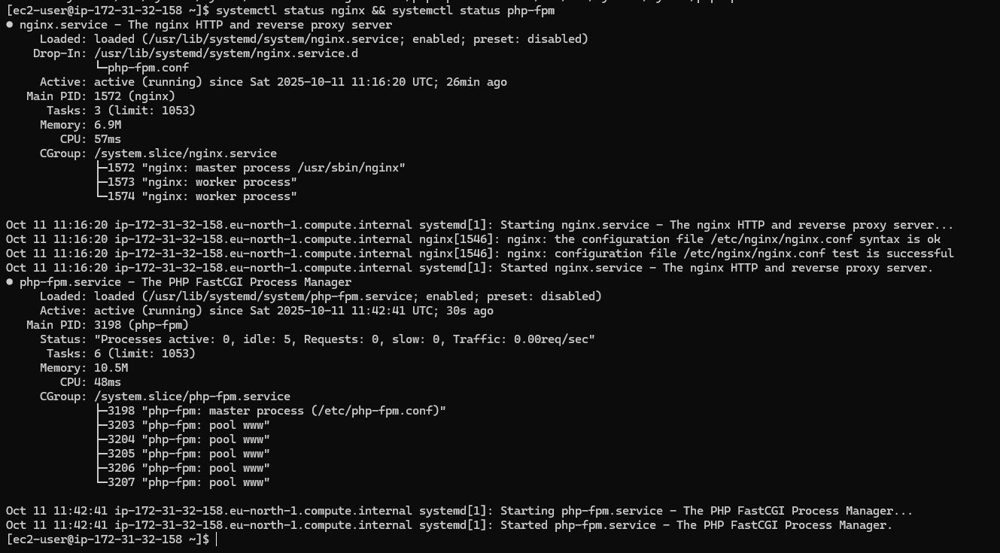

- Открыл сайт по публичному IP и проверил, что выдаётся обновлённая версия.

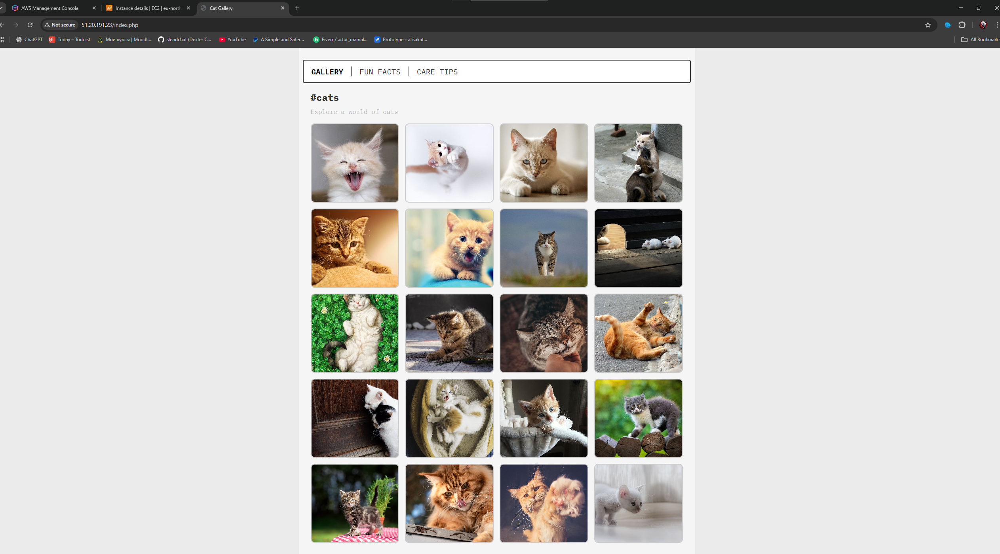

### Задание 7. Завершение работы и удаление ресурсов
- Через AWS CLI остановил инстанс, чтобы прекратить начисление платы за вычислительные ресурсы.

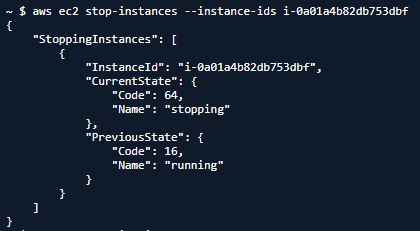

## Контрольные вопросы
- Политика `AdministratorAccess` предоставляет полные права на все ресурсы и сервисы AWS; она используется для административных пользователей и должна выдаваться ограниченному числу людей.
- User Data — это скрипт, который выполняется при запуске инстанса и автоматизирует начальную настройку. В моём случае скрипт устанавливает пакеты, включая Nginx, и запускает веб-сервер. Nginx нужен для обработки HTTP-запросов и проксирования их в PHP-FPM.
- Детализированный мониторинг (1-минутные метрики) стоит включать, когда требуются более точные графики нагрузки, быстрые реакции CloudWatch Alarm, автоскейлинг или когда важно собирать метрики для SLA.
- Парольный доступ к SSH в AWS по умолчанию запрещён, потому что ключи обеспечивают более высокую безопасность: приватный ключ хранится только у пользователя, исключает брутфорс и не требует передачи пароля по сети.
- Конфигурационный файл `nginx_mywebsite.conf` описывает виртуальный хост: слушает порт 80, указывает корневую директорию `/usr/share/nginx/html`, разрешает обработку PHP через сокет PHP-FPM и запрещает доступ к скрытым файлам.
- Команда `Stop` выключает виртуальную машину, сохраняя диск и все настройки для последующего запуска. `Terminate` полностью удаляет инстанс и освобождает связанные ресурсы; восстановить его уже нельзя.

## Как запустить сайт локально
```bash
cd lab02/public
php -S localhost:8000
```
После запуска сайт будет доступен по адресу `http://localhost:8000`.

## Выводы
В ходе лабораторной работы я прошёл полный цикл подготовки инфраструктуры в AWS: создал учётные записи, настроил бюджет, развернул и сконфигурировал EC2-инстанс, подключился к нему по SSH, настроил Nginx + PHP-FPM и опубликовал собственное приложение. Дополнительно закрепил навыки диагностики через журналы и мониторинг, а также научился корректно останавливать ресурсы.

## Использованные источники
- Официальная документация AWS: https://docs.aws.amazon.com/
- Руководство по Amazon Linux 2023: https://docs.aws.amazon.com/linux/
- Документация по Nginx: https://nginx.org/en/docs/
- Документация по PHP-FPM: https://www.php.net/manual/en/install.fpm.php
