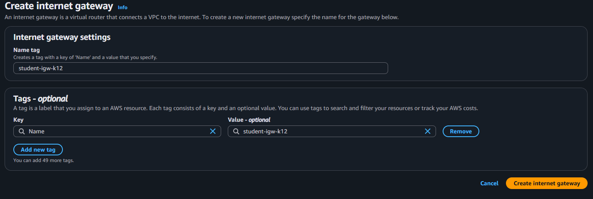

# Лабораторная работа №3. Облачные сети (AWS VPC)

## Описание лабораторной работы
Ручная сборка облачной сети в AWS: создание `VPC`, публичной и приватной подсетей, таблиц маршрутов, `Internet Gateway (IGW)`, `NAT Gateway`, групп безопасности (`Security Groups`) и трёх EC2‑инстансов (web, db, bastion). Настройка связности между веб‑сервером в публичной подсети и БД в приватной, проверка доступа и изоляции.

> Регион: Frankfurt (`eu-central-1`), номер группы: `k12` (имена ресурсов и CIDR выбраны соответствующе).

## Постановка задачи
- Спроектировать и развернуть изолированную виртуальную сеть `VPC` с двумя подсетями: публичной для веб‑сервера и приватной для базы данных.
- Обеспечить доступ ресурсов приватной подсети в интернет через `NAT Gateway`.
- Организовать безопасный доступ в приватную подсеть через `Bastion Host`.
- Проверить работоспособность (HTTP к веб‑серверу, SSH/SQL через bastion к БД) и изоляцию.

## Цели и этапы
- Создать `VPC` и привязать `IGW`.
- Создать публичную и приватную подсети и соответствующие `Route Tables`.
- Выделить `Elastic IP` и создать `NAT Gateway` в публичной подсети; добавить маршрут из приватной через NAT.
- Настроить `Security Groups` (web, bastion, db) по принципу наименьших привилегий.
- Запустить EC2‑инстансы (web, db, bastion) и проверить связность.

## Теория кратко
- `VPC` — изолированная виртуальная сеть в AWS.
- `IGW` — шлюз для выхода из VPC в Интернет (только для подсетей/маршрутов, где он указан как целевой).
- `NAT Gateway` — управляемый сервис для исходного доступа приватных ресурсов в Интернет без входящих снаружи подключений.
- `Route Table` — определяет направление трафика (напр. «весь внешний трафик 0.0.0.0/0 → IGW или NAT»).
- `Security Group` — виртуальный межсетевой экран уровня инстанса (stateful).
- `Bastion Host` — узел‑посредник в публичной подсети для безопасного админ‑доступа к приватным ресурсам.

## Практическая часть

### 1. Создание VPC
- Name: `student-vpc-k12`
- IPv4 CIDR: `10.12.0.0/16`
- Tenancy: `Default`


Ответ на контрольный вопрос: что обозначает маска `/16` и почему не `/8`?
- `/16` — это префиксная длина, означающая, что первые 16 бит адреса — сеть. Диапазон `10.12.0.0/16` содержит 65 536 адресов (≈ 65k), чего достаточно для учебной VPC и удобно дробить на /24 подсети.
- `/8` («10.0.0.0/8») слишком велик для учебных целей, неудобен для планирования и может конфликтовать с существующими корпоративными схемами адресации/пированием. AWS также рекомендует выбирать CIDR разумного размера под задачи.

### 2. Internet Gateway (IGW)
Создан `student-igw-k12` и прикреплён к `student-vpc-k12`.




### 3. Подсети

3.1 Публичная подсеть
- Name: `public-subnet-k12`
- AZ: `eu-central-1a`
- CIDR: `10.12.1.0/24`


Ответ: является ли подсеть «публичной» прямо сейчас? Нет. Подсеть становится публичной, когда у неё есть маршрут `0.0.0.0/0` на `IGW` и включено автоназначение публичного IP (или вручную назначен Elastic/Public IP). Пока маршрут не добавлен, она не публичная.

3.2 Приватная подсеть
- Name: `private-subnet-k12`
- AZ: `eu-central-1b`
- CIDR: `10.12.2.0/24`


Ответ: является ли подсеть «приватной» прямо сейчас? Фактически да, так как по умолчанию у неё нет маршрута на `IGW` и внешней связности. Формально приватной она считается, когда её `Route Table` не ведёт напрямую в Интернет (обычно — через `NAT Gateway` для исходящего трафика).

### 4. Таблицы маршрутов (Route Tables)

4.1 Публичная таблица маршрутов
- Name: `public-rt-k12`
- Правило: `0.0.0.0/0 → IGW (student-igw-k12)`
- Ассоциация: `public-subnet-k12`


Ответ: зачем привязывать таблицу маршрутов к подсети? Чтобы подсеть начала использовать именно эту таблицу и её правила. Без ассоциации подсеть останется за основной (main) RT, что может не содержать нужного выхода в Интернет.

4.2 Приватная таблица маршрутов
- Name: `private-rt-k12`
- Ассоциация: `private-subnet-k12`


На этом этапе у приватной подсети ещё нет выхода в Интернет.

### 5. NAT Gateway

5.1 Elastic IP
Выделен EIP для `NAT Gateway`.


5.2 Создание NAT Gateway
- Name: `nat-gateway-k12`
- Subnet: `public-subnet-k12` (обязательно публичная)
- Connectivity: `Public`
- Привязан выделенный EIP


5.3 Маршрут из приватной таблицы через NAT
- В `private-rt-k12`: `0.0.0.0/0 → NAT (nat-gateway-k12)`


Ответ: как работает NAT Gateway? Приватные инстансы отправляют исходящий трафик в Интернет через NAT. Для внешних сервисов весь трафик выглядит исходящим от публичного IP NAT. Входящие, неинициированные соединения извне к приватным инстансам блокируются, сохраняя их недоступными из Интернета.

### 6. Группы безопасности (Security Groups)

6.1 Web SG
- Name: `web-sg-k12`
- Inbound: `HTTP 80` из `0.0.0.0/0`, `HTTPS 443` из `0.0.0.0/0`


6.2 Bastion SG
- Name: `bastion-sg-k12`
- Inbound: `SSH 22` — только с моего публичного IP


6.3 DB SG
- Name: `db-sg-k12`
- Inbound: `MySQL 3306` от `web-sg-k12` и `bastion-sg-k12`
- Inbound: `SSH 22` от `bastion-sg-k12`


Ответ: что такое Bastion Host и зачем он нужен? Это промежуточный узел в публичной подсети, через который администратор попадает в приватную зону (SSH/порт‑форвардинг/агент‑форвардинг). Он уменьшает поверхность атаки: приватные инстансы не имеют публичных IP и не принимают прямые подключения из Интернета.

### 7. EC2‑инстансы

- AMI: Amazon Linux 2
- Тип: `t3.micro`
- Key Pair: `student-key-k12.pem` (в репозитории: `lab03/ssh/student-key-k12.pem`)
- Диск: по умолчанию (8ГБ)


Созданы три инстанса:
1) `web-server` — `public-subnet-k12`, Public IP: Enabled, SG: `web-sg-k12`

User Data:
```bash
#!/bin/bash
dnf install -y httpd php
echo "<?php phpinfo(); ?>" > /var/www/html/index.php
systemctl enable httpd
systemctl start httpd
```

2) `db-server` — `private-subnet-k12`, Public IP: Disabled, SG: `db-sg-k12`

User Data:
```bash
#!/bin/bash
dnf install -y mariadb105-server
systemctl enable mariadb
systemctl start mariadb
mysql -e "ALTER USER 'root'@'localhost' IDENTIFIED BY 'StrongPassword123!'; FLUSH PRIVILEGES;"
```

3) `bastion-host` — `public-subnet-k12`, Public IP: Enabled, SG: `bastion-sg-k12`

User Data:
```bash
#!/bin/bash
dnf install -y mariadb105
```


### 8. Проверка работы

8.1 Доступ к web‑серверу
- Открыт публичный IP `web-server` в браузере, страница `phpinfo()` доступна.


8.2 Доступ по SSH к bastion
```bash
ssh -i student-key-k12.pem ec2-user@<BASTION_PUBLIC_IP>
```


8.3 Доступ из bastion к БД (приватный IP БД)
```bash
mysql -h <DB_PRIVATE_IP> -u root -p
```


8.4 Проверка исхода в Интернет из приватной подсети
- С bastion — доступ в Интернет есть (проверка `ping`/`dnf update`).
- С `db-server` — исходящий доступ через `NAT Gateway` работает (обновления, установка `htop`).

### 9. Дополнительное задание: SSH Agent Forwarding и ProxyJump


На локальной машине:
```bash
eval "$(ssh-agent -s)"
ssh-add student-key-k12.pem
```

Подключение в приватную подсеть через bastion:
```bash
ssh -A -J ec2-user@<BASTION_PUBLIC_IP> ec2-user@<DB_PRIVATE_IP>
```

Ответ: что делают опции `-A` и `-J`?
- `-A` — включает SSH Agent Forwarding (пробрасывает ключи из локального ssh-agent на удалённый хост), чтобы с bastion можно было аутентифицироваться на второй хост без копирования приватного ключа.
- `-J` — ProxyJump: устанавливает прыжок через bastion, эквивалентно ProxyCommand на основе `ssh -W`.

Завершение работы с агентом:
```bash
ssh-agent -k
```

## Ответы на ключевые контрольные вопросы (сводно)
- Маска `/16`: 65 536 адресов, удобна для разбиения на подсети `/24`; `/8` слишком велик и непрактичен, К тому же нельзя создать VPC с маской меньше чем /16
- Публичность подсети: определяется маршрутом `0.0.0.0/0 → IGW` и публичным IP на инстансе.
- Приватность подсети: отсутствие прямого маршрута на `IGW`; исходящий доступ — через `NAT`.
- Привязка `Route Table` к подсети: активирует нужные маршруты для конкретной подсети.
- Как работает `NAT Gateway`: даёт исходящий Интернет приватным ресурсам, скрывает их за своим публичным IP, не принимает входящие неинициированные соединения.
- `Bastion Host`: SSH‑шлюз в публичной подсети для админ‑доступа к приватным инстансам.
- `ssh -A` и `ssh -J`: агент‑форвардинг и прыжок через промежуточный хост соответственно.

## Вывод
Создана работоспособная архитектура: `VPC` с публичной и приватной подсетями, `IGW`, `NAT Gateway`, отдельные `Route Tables`, SG по ролям и три EC2‑инстанса. Веб‑сервер доступен из Интернета по HTTP, доступ к БД возможен только через `Bastion Host`; приватная подсеть изолирована от входящих соединений, при этом имеет исходный доступ в Интернет через NAT. Все проверки выполнены успешно.

## Список источников
- Документация AWS VPC: https://docs.aws.amazon.com/vpc/
- Документация Amazon EC2: https://docs.aws.amazon.com/ec2/
- Best Practices for VPC Subnets and Routing (AWS Blogs)
