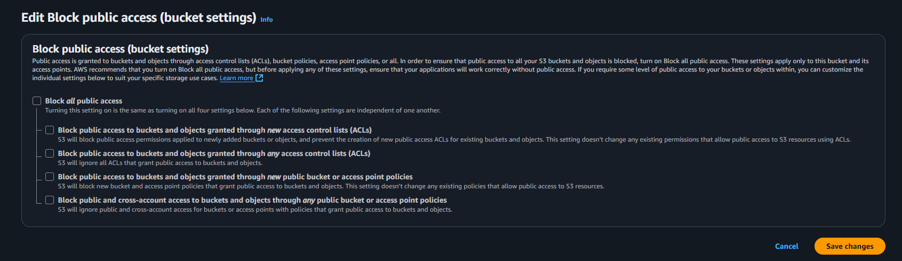

# Лабораторная работа 04 — S3 Variant B (Object Ownership Enforced, без ACL)

Отчёт о выполнении задания за несколько дней. Делал по частям, иногда возвращался и проверял настройки повторно. Местами путался в ACL и политиках, но разобрался. Ниже все шаги, скриншоты и ответы на контрольные вопросы.

## Шаг 1. Создание бакетов без ACL

Создал два бакета в `eu-central-1` c Object Ownership = Bucket owner enforced (ACLs disabled):
- публичный: `cc-lab4-pub-kXX`
- приватный: `cc-lab4-priv-kXX`

Важно: в этом режиме все объекты принадлежат владельцу бакета, ACL полностью отключены, доступ управляется только через IAM и Bucket Policy.


## Шаг 2. IAM-пользователь и минимальные права

Создал пользователя `s3-uploader` без console access. Сгенерировал `Access key ID` и `Secret access key` для CLI/SDK. Далее сделал кастомную политику с принципом минимально необходимых прав.

### 2.1. Политика для `s3-uploader`

Смысл политики:
- Разрешить `ListBucket` только для двух бакетов
- В публичном бакете — читать/заливать/удалять объекты (ограниченно префиксами при необходимости)
- В приватном — доступ только под префиксом `logs/`

Использовал корректные ARN с `/*` для объектов (иначе будет не работать как ожидалось):

```json
{
  "Version": "2012-10-17",
  "Statement": [
    {
      "Sid": "ListOnlyTheseBuckets",
      "Effect": "Allow",
      "Action": ["s3:ListBucket"],
      "Resource": [
        "arn:aws:s3:::cc-lab4-pub-kXX",
        "arn:aws:s3:::cc-lab4-priv-kXX"
      ]
    },
    {
      "Sid": "ReadWritePublicBucketLimited",
      "Effect": "Allow",
      "Action": ["s3:GetObject", "s3:PutObject", "s3:DeleteObject"],
      "Resource": "arn:aws:s3:::cc-lab4-pub-kXX/*"
    },
    {
      "Sid": "LogsRWButOnlyUnderLogsPrefix",
      "Effect": "Allow",
      "Action": ["s3:GetObject", "s3:PutObject", "s3:DeleteObject"],
      "Resource": "arn:aws:s3:::cc-lab4-priv-kXX/logs/*"
    }
  ]
}
```


## Шаг 3. Публичное чтение в публичном бакете (через Bucket Policy)

Чтобы сделать публичный доступ к чтению только для отдельных префиксов, отключил «Block all public access» на бакете (это осознанно под лабу), и добавил Bucket Policy. В Object Ownership Enforced ACL не используются, поэтому доступ открывается политикой бакета.



Политика бакета (публичное чтение только для `avatars/` и `content/`):

```json
{
  "Version": "2012-10-17",
  "Statement": [
    {
      "Sid": "AllowPublicRead",
      "Effect": "Allow",
      "Principal": "*",
      "Action": "s3:GetObject",
      "Resource": [
        "arn:aws:s3:::cc-lab4-pub-kXX/avatars/*",
        "arn:aws:s3:::cc-lab4-pub-kXX/content/*"
      ]
    }
  ]
}
```


## Шаг 4. Загрузка объектов

### 4.1. Через AWS Management Console

В бакете `cc-lab4-pub-kXX` загрузил аватар `avatars/user1.jpg`. В режиме Owner enforced консоль не даёт назначать ACL (и это правильно), поэтому публичность обеспечивается политикой бакета, а не `public-read` на объекте.

### 4.2. Через AWS CLI

Настроил AWS CLI под пользователя `s3-uploader` и выполнил загрузки. Для бакета с отключенными ACL флаг `--acl public-read` указывать не надо (и даже нельзя), публичность уже дана политикой бакета:

```bash
# аватар в публичный бакет
aws s3 cp s3-lab/public/avatars/user2.jpg s3://cc-lab4-pub-kXX/avatars/user2.jpg

# контент в публичный бакет
aws s3 cp s3-lab/public/content/logo.png s3://cc-lab4-pub-kXX/content/logo.png

# приватный CSV в приватный бакет (не публичный)
aws s3 cp s3-lab/private/activity.csv s3://cc-lab4-priv-kXX/activity.csv
```

Если бы ACL были разрешены, то можно было бы добавить `--acl public-read` для явной выдачи прав на объект, но в данном варианте B ACL отключены.

Скрин подтверждения загрузки через CLI:


## Шаг 5. Проверка доступа

Публичный URL для аватара открылся в браузере:

`https://cc-lab4-pub-kXX.s3.eu-central-1.amazonaws.com/avatars/user1.jpg`


Для приватного файла прямой доступ возвращает отказ (как и должно быть). В консоли он виден, но по общедоступной ссылке открыть нельзя:


## Шаг 6. Версионирование объектов

Включил версионирование на обоих бакетах. После этого заменил `content/logo.png` на новую версию — в разделе Versions появились две версии, как ожидалось.


Ответ на вопрос: если выключить версионирование после включения, новые версии просто перестанут создаваться (режим становится Suspended), но уже существующие версии сохраняются, никуда не пропадают. Удаления станут помечаться delete‑маркерами.

## Шаг 7. Lifecycle-правила для приватного бакета

Создал правило `logs-archive` для префикса `logs/`:
- Transition → Standard-IA через 30 дней
- Transition → Glacier Deep Archive через 365 дней
- Expiration → удалить через 1825 дней (5 лет)


Ответ на вопрос про Storage Class: классы хранения (Standard, Standard‑IA, One Zone‑IA, Glacier…)
нужны для баланса цены, доступности и времени восстановления. Мы переводим старые/редко используемые данные на более дешёвые классы, экономя деньги без потери надёжности.

## Шаг 8. Статический веб-сайт на S3

Создал бакет `cc-lab4-web-kXX` под хостинг статики. Здесь по заданию разрешены ACL (ACLs enabled), публичный доступ включил и настроил Static website hosting с `index.html`.


Залил файлы из папки репозитория `lab04/web` (`index.html`, `index.js`, `style.css`) и сделал их публичными. Сайт корректно открывается по выданному S3 website endpoint. Скриншоты интерфейса и результата:


## Контрольные вопросы — ответы

- Чем отличается ключ (object key) от имени файла?
  - Object key — это полный путь внутри бакета (набор префиксов + имя), который однозначно идентифицирует объект. Имя локального файла может быть любым и не обязано совпадать; «папки» в S3 — это логические префиксы, а не директории.

- Разница между `aws s3 cp`, `mv` и `sync`, и зачем `--acl public-read`?
  - `cp` копирует файлы/каталоги; `mv` копирует и удаляет источник (перемещение);
    `sync` двунаправленно сравнивает и синхронизирует каталоги (копирует только недостающие/изменённые). Флаг `--acl public-read` даёт публичное чтение объекту через ACL, но он не применим когда на бакете включён Object Ownership Enforced (ACL отключены). В нашем публичном бакете доступ открыт политикой.

- Что произойдёт, если выключить версионирование после его включения?
  - Версионирование перейдёт в Suspended: новые версии создаваться не будут, существующие сохранятся. Удаления будут помечаться delete‑markers.

- Что такое Storage Class в Amazon S3 и зачем они нужны?
  - Это классы хранения с разной ценой/доступностью/временем восстановления. Нужны для оптимизации стоимости и политик жизненного цикла (перевод редко используемых данных в дешёвые классы, типа Glacier Deep Archive).

---

## Выводы

За несколько дней настроил S3 по современному подходу без ACL, выдал минимальные права пользователю, открыл публичное чтение через Bucket Policy, проверил доступ, включил версионирование и lifecycle. Отдельно развернул статический веб‑сайт на S3. Теперь у меня есть понятная схема как разделять публичные и приватные данные и управлять ими централизовано. Немного времени ушло на нюансы с `--acl` и режимом owner enforced, но теперь ясно почему так безопаснее и проще поддерживать.
