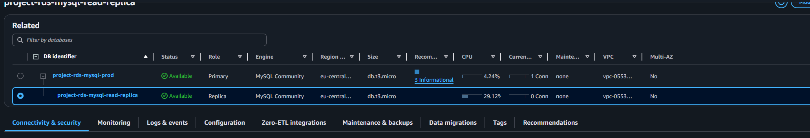
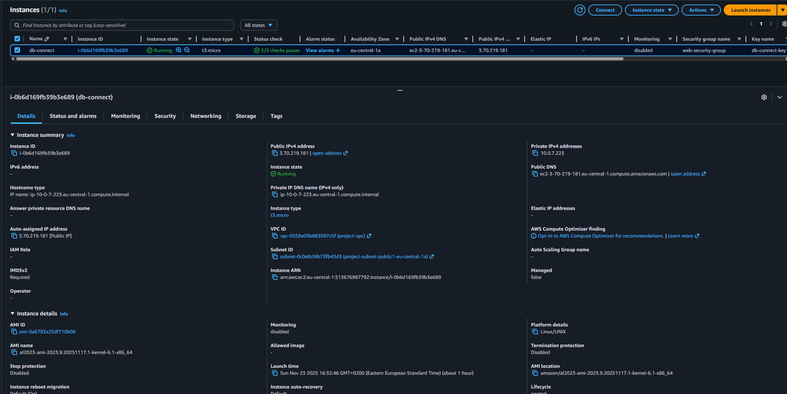
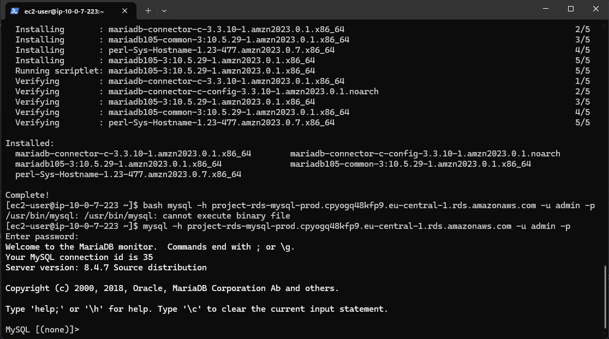

# Лабораторная работа №5. Облачные базы данных: Amazon RDS и DynamoDB

## Описание и цель
В этой работе я познакомился с Amazon RDS и DynamoDB, развернул MySQL в AWS RDS вместе с read replica, подключился к базе с EC2, выполнил CRUD-операции и развернул простое веб‑приложение, которое пишет в мастер и читает из реплики. Дополнительно зафиксировал выводы SQL‑запросов и проверил ограничения read-only на реплике.

## Постановка задачи
- Создать VPC, подсети и security groups для веб-приложения и MySQL RDS.
- Развернуть основной экземпляр RDS `project-rds-mysql-prod` c БД `project_db` и read replica `project-rds-mysql-read-replica`.
- Создать EC2 в публичной подсети, настроить доступ к RDS.
- Создать связанные таблицы `categories` и `todos`, наполнить данными, выполнить выборки и агрегаты.
- Проверить поведение read replica (чтение, запрет на запись).
- Написать и развернуть на EC2 веб-приложение (PHP) с разделением: запись - мастер, чтение - реплика.

## Практическая часть

### 1. Подготовка сети
Я создал VPC `project-vpc` с публичными и приватными подсетями, настроил две security groups:
- `web-security-group` (HTTP 80, SSH 22 входящие; исходящий MySQL 3306 к БД).
- `db-mysql-security-group` (вход MySQL 3306 только от `web-security-group`).

Скрин VPC:  


### 2. Развертывание RDS и Read Replica
- Создал Subnet Group `project-rds-subnet-group` с приватными подсетями в двух AZ.
- Поднял RDS MySQL 8.0.42 `project-rds-mysql-prod` (db.t3.micro, gp3 20GB, backups включены, auto-upgrade выкл, Initial DB: `project_db`).
- Создал read replica `project-rds-mysql-read-replica` (db.t3.micro, тот же SG, без public access).

Скрин RDS:  


### 3. EC2 и клиент
Развернул EC2 в публичной подсети, назначил `web-security-group`, установил MySQL/MariaDB client для проверки соединения.

Скрин EC2:  


### 4. Создание схемы и данные
Подключился к мастеру по endpoint и выполнил SQL из `lab05/mysql_tasks`:



```sql
USE project_db;

CREATE TABLE categories (
    id INT AUTO_INCREMENT PRIMARY KEY,
    name VARCHAR(100) NOT NULL
);

CREATE TABLE todos (
    id INT AUTO_INCREMENT PRIMARY KEY,
    title VARCHAR(200) NOT NULL,
    category_id INT NOT NULL,
    status VARCHAR(50) NOT NULL,
    CONSTRAINT fk_category
        FOREIGN KEY (category_id)
        REFERENCES categories(id)
        ON DELETE CASCADE
        ON UPDATE CASCADE
);
```

Наполнил данными:

```sql
INSERT INTO categories (name)
VALUES ('Home'), ('Work'), ('Hobby');

INSERT INTO todos (title, category_id, status)
VALUES
    ('Wash dishes', 1, 'pending'),
    ('Clean house', 1, 'done'),
    ('Prepare report', 2, 'pending'),
    ('Fix production bug', 2, 'in progress'),
    ('Paint a picture', 3, 'pending'),
    ('Practice guitar', 3, 'done');
```

Проверил выборки:

```sql
SELECT * FROM categories;
-- Home, Work, Hobby

SELECT * FROM todos;
-- 6 задач с категориями 1..3

SELECT t.id, t.title, t.status, c.name AS category
FROM todos t JOIN categories c ON t.category_id = c.id;
-- каждая задача с именем категории

SELECT t.id, t.title, t.status
FROM todos t JOIN categories c ON t.category_id = c.id
WHERE c.name = 'Work';
-- вернулось 2 задачи для категории Work

SELECT c.name AS category, COUNT(t.id) AS tasks_count
FROM categories c LEFT JOIN todos t ON c.id = t.category_id
GROUP BY c.id, c.name;
-- по 2 задачи на каждую категорию
```

### 5. Проверка read replica
- На реплике чтение работает: `SELECT * FROM categories;` и `SELECT * FROM todos;` показывают те же 6 записей.
- Попытки записи на реплике:

```sql
INSERT INTO categories (name) VALUES ('TestOnReplica');
-- ERROR 1290: read-only

UPDATE categories SET name = 'NewName' WHERE id = 1;
-- ERROR 1290: read-only
```

Это подтвердило режим read-only на реплике. После добавления записей на мастере данные появляются на реплике после задержки репликации (eventual consistency).

### 6. CRUD-приложение (master - write, replica - read)
Я написал простое PHP-приложение (`lab05/app`), которое:
- использует мастер для `CREATE/UPDATE/DELETE` и реплику для `SELECT`;
- работает с таблицами `categories` и `todos` (статусы: pending / in progress / done).

Ключевые файлы:
- `app/index.php` — форма создания/редактирования и таблица списков (чтение с реплики).
- `app/db.php` — подключения PDO к мастеру и реплике через env vars (`DB_MASTER_HOST`, `DB_REPLICA_HOST`, `DB_NAME=project_db`, `DB_USER=admin`, `DB_PASS=osSCK9PC`, `DB_PORT=3306`).
- `app/deploy_amazon_linux.sh` — установка Apache+PHP на Amazon Linux и выкладка в `/var/www/html/app` с нужными `SetEnv`.

### 7. Развертывание на EC2
На EC2 в каталоге `app` я выполнил:

```bash
chmod +x deploy_amazon_linux.sh
DB_MASTER_HOST="project-rds-mysql-prod.cpyogq48kfp9.eu-central-1.rds.amazonaws.com" \
DB_REPLICA_HOST="project-rds-mysql-read-replica.cpyogq48kfp9.eu-central-1.rds.amazonaws.com" \
DB_NAME="project_db" DB_USER="admin" DB_PASS="" \
bash deploy_amazon_linux.sh
```

Apache получает переменные через `/etc/httpd/conf.d/rds-app-env.conf`, после чего приложение доступно по `http://<EC2-Public-IP>/app/`.

### 8. Ответы на контрольные вопросы
- **Что такое Subnet Group и зачем она нужна?** Это список приватных подсетей в разных AZ, в которых RDS может поднять свои сетевые интерфейсы. Без неё RDS не знает, куда разворачивать инстанс и реплику.
- **Какие данные видно на read replica и почему?** Видны все подтвержденные записи с мастера, потому что реплика получает бинарные логи и применяет их асинхронно (eventual consistency).
- **Получилось ли выполнить запись на реплике? Почему?** Нет, сервер запускается с `--read-only`; это защищает реплику от изменений и гарантирует консистентность с мастером.
- **После добавления записи на мастере появилась ли она на реплике? Почему?** Да, после короткой задержки, так как реплика применяет события из binlog мастера.
- **Зачем нужны Read Replicas и когда полезны?** Они разгружают мастер для чтений, повышают масштабируемость и дают дополнительную отказоустойчивость для чтения/бэкапов; полезны при read-heavy нагрузках и для аналитики.

## Выводы
Я развернул RDS MySQL с read replica, настроил безопасный доступ через SG, выполнил CRUD‑операции с привязкой к существующим таблицам, проверил ограничения на реплике, и написал веб-приложение, которое строго пишет в мастер и читает из реплики. Теперь у меня есть рабочий пример разделения read/write в AWS и понимание, когда применять read replicas для масштабирования.
