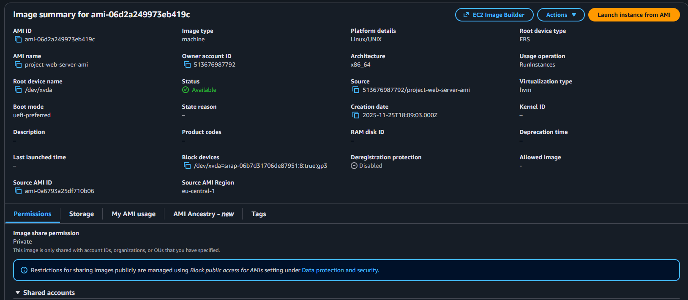
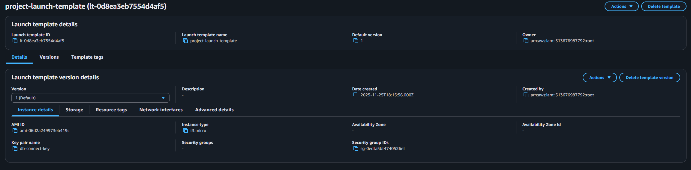
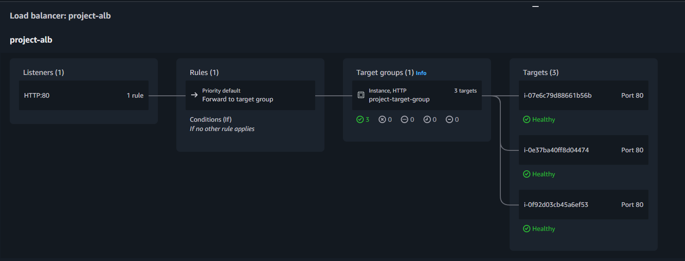
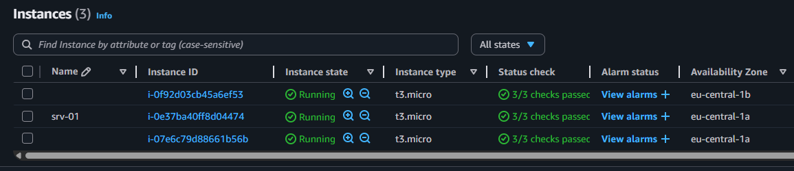
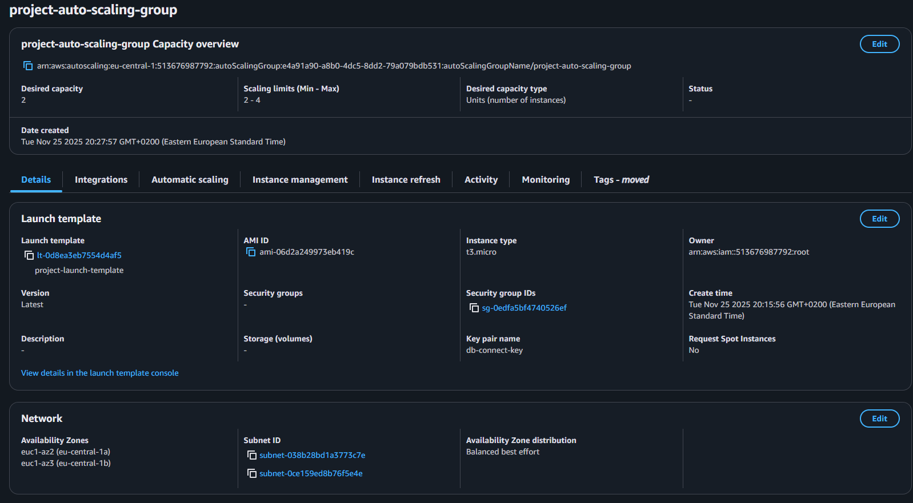
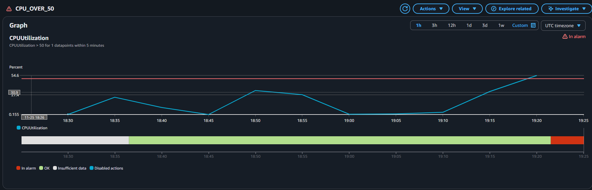
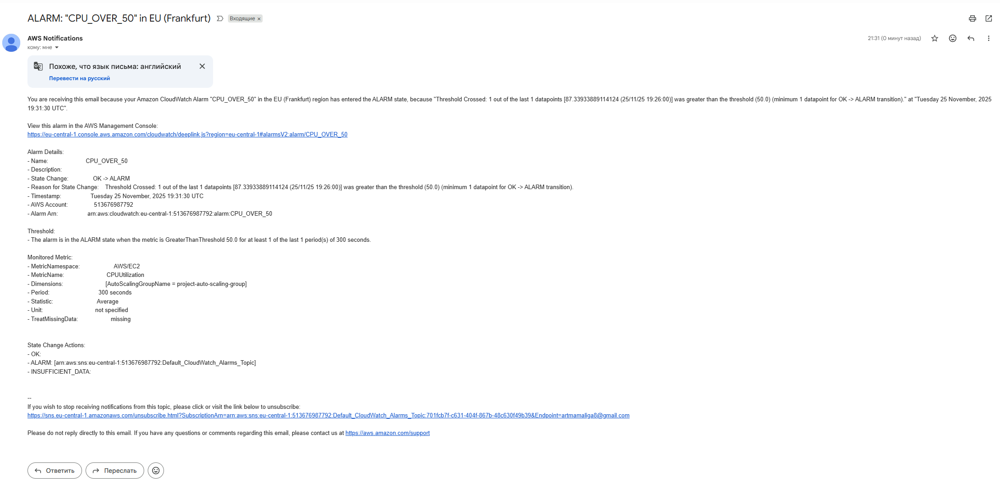

# Лабораторная работа №6. Балансирование нагрузки в облаке и авто-масштабирование

## Описание лабораторной работы
Развернул отказоустойчивую веб-архитектуру в AWS с балансировкой нагрузки и авто-масштабированием. В процессе создал VPC с публичными и приватными подсетями, поднял веб-сервер на Amazon Linux 2, подготовил AMI, настроил Launch Template, Application Load Balancer, Target Group и Auto Scaling Group. Нагрузочное тестирование проводилось с помощью `hey`, результаты зафиксированы ниже.

## Цель и основные этапы работы
- Закрепить работу с EC2, ALB, Target Groups, Auto Scaling и CloudWatch.
- Настроить сетевую инфраструктуру (VPC, подсети, Internet Gateway, маршрутизация).
- Подготовить шаблон запуска инстансов и AMI для тиражирования.
- Реализовать балансировку нагрузки и автоматическое масштабирование по метрикам CPU.
- Провести нагрузочное тестирование и проанализировать метрики.

## Практическая часть

### 1. Создание VPC и подсетей
- Создана VPC с двумя публичными (10.0.1.0/24, 10.0.2.0/24) и двумя приватными подсетями в разных AZ, прикреплён Internet Gateway и настроена маршрутная таблица с выходом 0.0.0.0/0 через IGW.
- Ответ: публичные подсети дают выход в интернет и используются для ALB, приватные — для размещения приложений без прямого внешнего доступа.

### 2. Создание и настройка виртуальной машины
- Развёрнут EC2 (Amazon Linux 2, t3.micro) в публичной подсети с публичным IP, включён Detailed CloudWatch Monitoring.
- Security Group: SSH 22 (мой IP), HTTP 80 (0.0.0.0/0), исходящий — любой.
- В UserData применён скрипт и проверена работоспособность nginx по публичному IP.

### 3. Подготовка AMI
- Снято изображение `project-web-server-ami` из рабочего инстанса и проверено появление в списке AMIs.
- Ответ: AMI — преднастроенный образ инстанса (root volume + метаданные запуска). Snapshot — снимок отдельного тома EBS. AMI позволяет быстро тиражировать одинаковые инстансы.



### 4. Создание Launch Template
- Создан шаблон `project-launch-template` на основе AMI, с типом t3.micro, той же SG и включённым Detailed Monitoring.
- Ответ: Launch Template задаёт параметры будущих инстансов и поддерживает версионирование, несколько сетевых интерфейсов и гибкую конфигурацию. Launch Configuration — устаревший, без версий и с меньшей функциональностью.



### 5. Создание Target Group
- Создана Target Group `project-target-group` (Instances, HTTP:80) в созданной VPC, зарегистрированы целевые инстансы и включены health-check-и по HTTP.
- Ответ: Target Group объединяет цели для балансировщика, выполняет health-check-и и позволяет ALB маршрутизировать трафик на доступные инстансы.



### 6. Создание Application Load Balancer
- Настроен ALB `project-alb` (internet-facing) с HTTP:80 и дефолтным действием — проксирование в `project-target-group`. Использована та же SG и публичные подсети.
- Ответ: internet-facing получает публичный DNS и доступен из интернета; internal доступен только из VPC/peering. Default action — действие по умолчанию для listener (обычно forward в Target Group; возможны redirect или fixed-response).



### 7. Создание Auto Scaling Group
- Создана ASG `project-auto-scaling-group` на базе Launch Template, размещена в приватных подсетях, прикреплена к Target Group, включён сбор метрик ASG в CloudWatch.
- Параметры: min=2, desired=2, max=4; политика Target Tracking по Average CPU Utilization 50%, warm-up 60s.
- Ответы:
  - Приватные подсети для ASG повышают безопасность: инстансы недоступны напрямую, вход только через ALB.
  - Availability Zone distribution Balanced best effort распределяет инстансы по AZ для отказоустойчивости.
  - Instance warm-up — время на инициализацию перед учётом метрик в масштабировании, чтобы не реагировать на стартовые всплески.



### 8. Тестирование Application Load Balancer
- По DNS ALB открыта страница веб-сервера; при нескольких запросах видны разные приватные IP инстансов в ответах, что подтверждает балансировку.
- Ответ: возвращаются приватные IP целевых EC2, потому что ALB распределяет запросы между инстансами в Target Group.

### 9. Тестирование Auto Scaling и нагрузка
- Создан скрипт нагрузочного теста `load_hey.sh` (принимает количество потоков и длительность). Запуск производился на DNS ALB.

```bash
#!/bin/bash

# Usage: ./load_hey.sh <threads> <duration_seconds>

THREADS=${1:-10}
DURATION=${2:-60}

ALB_DNS="project-alb-857742360.eu-central-1.elb.amazonaws.com"
TARGET="http://$ALB_DNS/"

echo "========================================="
echo "Starting load with hey"
echo "Target: $TARGET"
echo "Threads: $THREADS"
echo "Duration: ${DURATION}s"
echo "========================================="

hey -c "$THREADS" -z "${DURATION}s" "$TARGET"
```

Результаты запуска (`./load_hey.sh 10 60`):

```
=========================================
Starting load with hey
Target: http://project-alb-857742360.eu-central-1.elb.amazonaws.com/
Threads: 10
Duration: 60s
=========================================

Summary:
  Total:        60.0352 secs
  Slowest:      0.1000 secs
  Fastest:      0.0359 secs
  Average:      0.0383 secs
  Requests/sec: 261.0302


Response time histogram:
  0.036 [1]     |
  0.042 [15056] |�-��-��-��-��-��-��-��-��-��-��-��-��-��-��-��-��-��-��-��-��-��-��-��-��-��-��-��-��-��-��-��-��-��-��-��-��-��-��-��-�
  0.049 [329]   |�-�
  0.055 [126]   |
  0.061 [59]    |
  0.068 [33]    |
  0.074 [34]    |
  0.081 [17]    |
  0.087 [7]     |
  0.094 [7]     |
  0.100 [2]     |


Latency distribution:
  10% in 0.0369 secs
  25% in 0.0372 secs
  50% in 0.0376 secs
  75% in 0.0382 secs
  90% in 0.0390 secs
  95% in 0.0410 secs
  99% in 0.0553 secs

Details (average, fastest, slowest):
  DNS+dialup:   0.0000 secs, 0.0359 secs, 0.1000 secs
  DNS-lookup:   0.0000 secs, 0.0000 secs, 0.0045 secs
  req write:    0.0000 secs, 0.0000 secs, 0.0212 secs
  resp wait:    0.0382 secs, 0.0356 secs, 0.0999 secs
  resp read:    0.0001 secs, 0.0000 secs, 0.0178 secs

Status code distribution:
  [200] 15671 responses
```

- После нагрузки в CloudWatch выросла метрика CPU Utilization, сработала целевая политика, ASG масштабировала количество инстансов до верхней границы при росте нагрузки и вернула desired после падения нагрузки.





### 10. Завершение работы и очистка
- Остановлен нагрузочный тест, удалены ALB, Target Group, ASG, инстансы, AMI (снимки), Launch Template и VPC.
- Ответ: Auto Scaling автоматически увеличивает/уменьшает число инстансов на основе метрик и поддерживает заданные границы, обеспечивая устойчивость и экономию ресурсов.

## Ответы на контрольные вопросы (кратко)
- AMI vs snapshot: AMI — образ инстанса с метаданными запуска; snapshot — снимок отдельного тома EBS; AMI используется для тиражирования и восстановления однотипных инстансов.
- Launch Template: шаблон параметров EC2 с версиями; Launch Configuration — устаревший без версионности и новых опций.
- Target Group: задаёт набор целей и health-check-и, на которые ALB/CLB/NLB направляют трафик.
- Internet-facing vs Internal: первый имеет публичный DNS и доступен из интернета; второй доступен только из приватных адресов внутри VPC/peering/VPN.
- Default action listener: действие по умолчанию, если правило не сработало (forward в TG, redirect, fixed-response).
- Почему приватные подсети для ASG: инстансы скрыты от публичного доступа, вход только через ALB.
- Availability Zone distribution: равномерно размещает инстансы по AZ для отказоустойчивости и балансировки.
- Instance warm-up: время инициализации инстанса перед учётом метрик в масштабировании, снижает ложные срабатывания.
- Какие IP видны при работе ALB: приватные IP целевых инстансов, потому что ALB распределяет запросы внутри Target Group.
- Роль Auto Scaling: поддерживает нужное количество инстансов, автоматически масштабируя парк по метрикам и заменяя некорректные экземпляры.

## Вывод
Развёрнута и протестирована масштабируемая архитектура с балансировкой нагрузки в AWS. Подготовленная AMI и Launch Template позволили автоматически тиражировать веб-серверы в приватных подсетях, ALB обеспечил равномерное распределение трафика, а Auto Scaling адаптировал количество инстансов под нагрузку. Метрики CloudWatch подтвердили корректную реакцию системы на рост запросов, а очистка ресурсов выполнена после завершения экспериментов.
